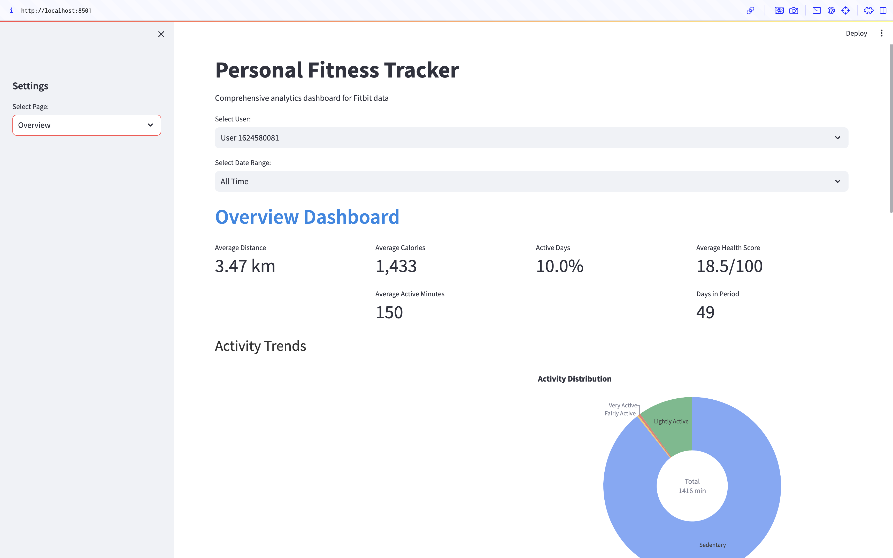
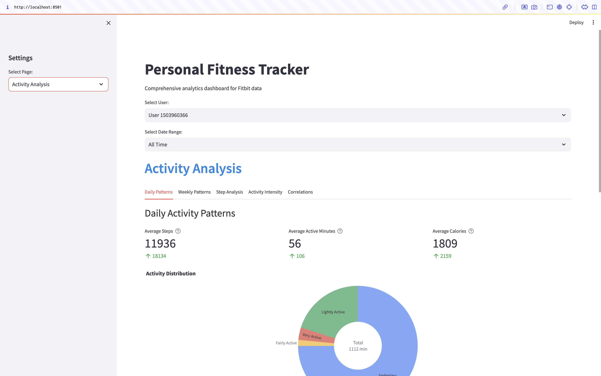
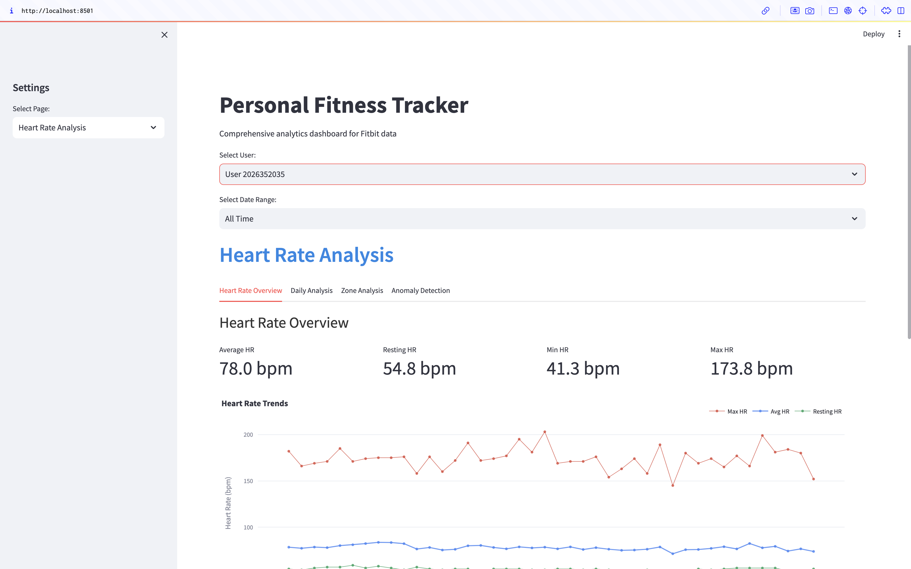
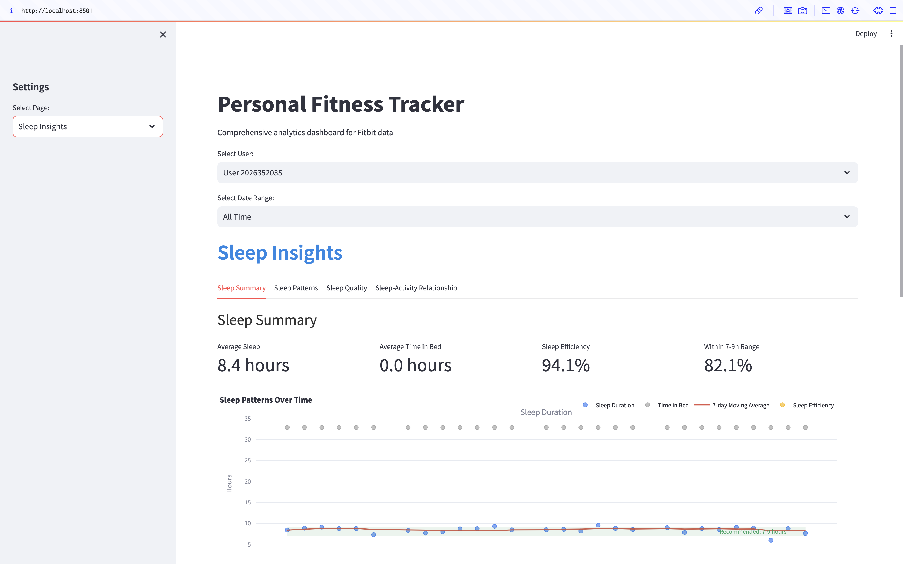
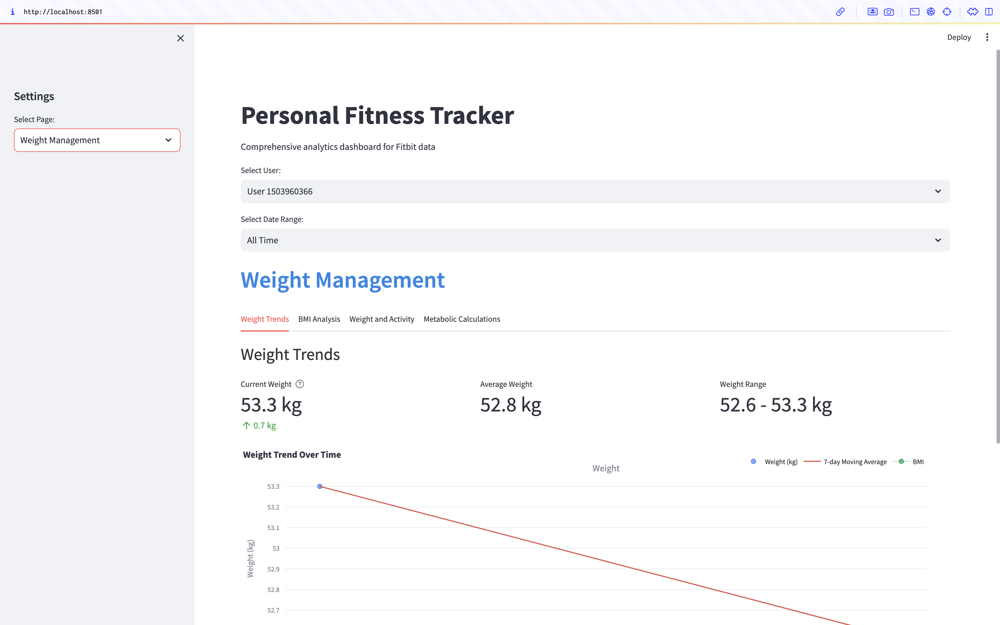

# Fitness Tracker Dashboard

A comprehensive analytics dashboard for Fitbit data that provides insights into physical activity, sleep patterns, heart rate, and weight metrics.
### Overview Dashboard


### Activity Patterns


### Heart Rate Analysis


### Sleep Insights


### Weight Management


## Features
- Overview Dashboard with activity summaries and trends
- Detailed Activity Analysis with pattern detection
- Sleep Insights with sleep quality metrics
- Heart Rate Analysis with zone detection
- Weight Management tools

## Data Requirements

This application requires Fitbit data in CSV format. The following files are needed:
- `dailyActivity_merged.csv`
- `sleepDay_merged.csv`
- `heartrate_seconds_merged.csv`
- `weightLogInfo_merged.csv`
- `hourlySteps_merged.csv`
- `hourlyCalories_merged.csv`
- `hourlyIntensities_merged.csv`

You can download sample data from [Kaggle's Fitbit Fitness Tracker Data](https://www.kaggle.com/datasets/arashnic/fitbit).

## Directory Structure
```bash
fitness-tracker/
├── app.py              # Main Streamlit application
├── src/
│   ├── analysis.py     # Analysis functions
│   ├── data_processing.py # Data processing functions
│   ├── utils.py        # Utility functions
│   └── visualization.py # Visualization functions
├── data/
│   ├── raw/            # Place raw CSV files here
│   └── processed/      # Processed data will be stored here
└── requirements.txt    # Dependencies
```
## Installation

```bash
# Clone the repository
git clone https://github.com/Yash-Shindey/fitness-tracker-dashboard.git
cd fitness-tracker-dashboard

# Install requirements
pip install -r requirements.txt

# Add your Fitbit data to the data/raw/fitbit directory

streamlit run app.py


Sample Data
Download the sample data from Kaggle and place the CSV files in the data/raw/fitbit directory.
